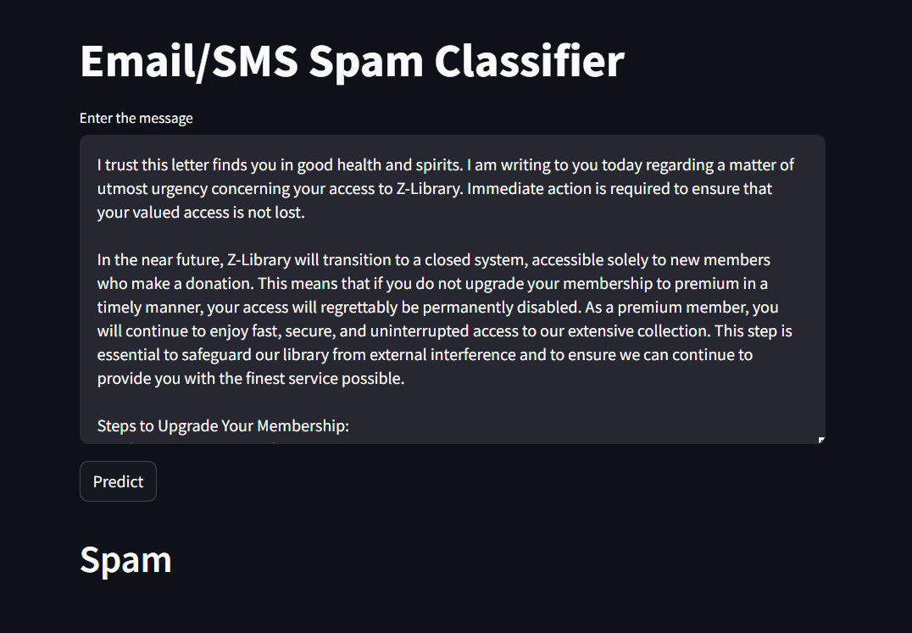

# Spam Email/SMS Detector

This repository contains a Machine Learning-based spam email and SMS classification model that leverages TF-IDF for text vectorization and ensemble learning methods to accurately detect spam. The model achieves an impressive accuracy of approximately 98%, ensuring reliable filtering of unwanted messages.

## Table of Contents
- [Project Overview](#project-overview)
- [Installation](#installation)
- [Dataset](#dataset)
- [Text Vectorization](#text-vectorization)
- [Model Training](#model-training)
- [Model Evaluation](#model-evaluation)
- [Model Deployment](#model-deployment)
- [Usage](#usage)
- [Results](#results)
- [Preview](#preview)
- [Contributing](#contributing)
- [License](#license)
- [Contact](#contact)

## Project Overview

The "Spam Email/SMS Detector" is a Machine Learning project aimed at classifying emails and SMS messages as either spam or not spam. The project employs Term Frequency-Inverse Document Frequency (TF-IDF) for text vectorization and an ensemble of models, including Support Vector Machine (SVM), Naive Bayes, and Extra Trees Classifier, to improve classification performance. The trained model achieves an accuracy of approximately 98%, with a precision of 99%, making it a highly reliable tool for detecting spam.

## Installation

1. Clone this repository:
    ```bash
    git clone https://github.com/yourusername/spam-email-sms-detector.git
    cd spam-email-sms-detector
    ```

2. Install the required dependencies:
    ```bash
    pip install -r requirements.txt
    ```

## Dataset

The dataset used for this project contains labeled email and SMS messages, where each message is marked as either spam or not spam. The dataset was preprocessed to remove any irrelevant information, and it was split into training and testing sets to evaluate the model's performance.

## Text Vectorization

The raw text data was transformed into a structured format using Term Frequency-Inverse Document Frequency (TF-IDF). This technique converts the text into numerical features that can be used as input for the machine learning models. The TF-IDF vectorizer captures the importance of each word in the context of the entire dataset, making it suitable for detecting patterns in spam messages.

## Model Training

An ensemble learning approach was employed to enhance the model's classification accuracy. The following models were included in the ensemble:
- **Support Vector Machine (SVM):** A powerful classifier that works well for high-dimensional data.
- **Naive Bayes:** A probabilistic classifier based on applying Bayes' theorem.
- **Extra Trees Classifier:** An ensemble learning method that combines the predictions of multiple decision trees.

Each model was trained on the TF-IDF features, and their predictions were combined to produce the final output.

## Model Evaluation

The model was evaluated on the test dataset, achieving the following metrics:
- **Accuracy:** ~98%
- **Precision:** 99%
- **Recall:** 97%
- **F1-Score:** 98%

These metrics indicate the model's robustness and effectiveness in detecting spam messages.

## Model Deployment

The trained model and the TF-IDF vectorizer were serialized using `pickle`, allowing for easy deployment in real-world applications. The model can be integrated into email or SMS filtering systems to automatically classify incoming messages.

## Usage

1. Load the serialized model and vectorizer:
    ```python
    import pickle

    with open('model.pkl', 'rb') as model_file:
        model = pickle.load(model_file)

    with open('vectorizer.pkl', 'rb') as vectorizer_file:
        vectorizer = pickle.load(vectorizer_file)
    ```

2. Use the model to predict whether a message is spam:
    ```python
    message = ["Your free prize is waiting! Claim now."]
    features = vectorizer.transform(message)
    prediction = model.predict(features)
    print("Spam" if prediction[0] else "Not Spam")
    ```

## Results

The model has demonstrated high accuracy and reliability in classifying messages as spam or not spam. With an accuracy of approximately 98% and a precision of 99%, it provides a robust solution for email and SMS spam detection.

## Preview

Here’s a preview of the web application:



## Contributing

Contributions are welcome! If you would like to improve the model, add new features, or fix bugs, please feel free to fork the repository and submit a pull request.

## License

This project is licensed under the MIT License - see the [LICENSE](LICENSE) file for details.

## Contact

If you have any questions or feedback, feel free to reach out to me:

- **Name:** Vedant Pimple
- **Email:** vedantpimple1775@gmail.com
